[← Volver al índice](../README.md)

# PROGRAMACIÓN SOBRE REDES

## TRABAJO PRACTICO TEORICO

## Programación sobre Redes

### Trabajo Practico Teórico

1- ¿Qué es una VLAN?

2- ¿Qué es una VPN?

3- ¿Qué es una SAN?

4- Diferencias entre un Hub, Repetidor, Router y SWITCH. Explicar las diferencias.

5- ¿Qué es un protocolo de comunicaciones?

6- Explique TCP/IP y NetBios, resuma sus diferencias. (Acá sí explicar cada uno y sus
diferencias)

7- ¿Cómo está formado un paquete de datos en TCP/IP? ¿Qué es un "flag" en un
paquete de TCP/IP?

8- Defina la red según su geografía. Explicar distintas variantes.

9- Defina una red según su topología. Explicar distintas variantes.

10- Explicar el servicio de DHCP.

11- Explicar el servicio de DNS.

12- Explicar las tecnologías Wireless, y sus estándares.

13- ¿Qué es un Proxy?

14- Explicar el protocolo Spanning tree.

15- Explicar el protocolo de comunicaciones OSPF.

16- Explicar el protocolo ARP.

17- ¿Qué es un Firewall?

18- ¿Qué es una DMZ?

19- ¿Qué es un Gateway?

20- Según Microsoft, ¿qué significa NBL?

21- Tipos de enlace: MPLS, LAN to LAN, microonda, VSAT.  
- a. Explique cada uno de estos tipos de enlace.
- b. Agregue dos tipos de enlaces, no mencionados anteriormente.
- c. Ranking de enlaces según lo pedido (de uno a seis, siendo uno el mejor): Por económico, performance, mayor capacidad, mayor o mejor configuración de restricciones, soporte a mayor distancia, menor esfuerzo de configuración.
- d. Elija un tipo de enlace para los siguientes escenarios: 
    1. Conectividad de varios de call centers con un data center central. 
    2. Conectar los datos de los pozos petroleros durante 15 minutos por día. 
    3. Comunicar dos edificios enfrentados en la misma calle.

22- Describir la tecnología LTE.

23- Explique la solución de Microsoft Teams. Si quieren describir otra solución de otra
empresa es también válido.

24- ¿Qué significa aplicar calidad en un enlace MPLS?

25- ¿Qué diferencias puede encontrar entre una conexión Coaxial, UTP o Fibra?

26- Según Cisco, ¿qué significa CCENT, CCNA y CCNP? Descripción breve del Track
Routing & Switching y de algún otro a elección (ej. Wireless, Security, Cloud, etc).

27- Explique el modelo OSI.

28- Realizar cuestionario online y copiar el resultado: (1 por cada integrante)
https://es.educaplay.com/es/recursoseducativos/706834/test_de_redes_y_comunicacion
es.htm (OPCIONAL)

29- Explicar el estándar IEEE 802.3 regula la red. Cómo se implementa, ventajas y
desventajas.

30- Explicar el estándar IEEE 802.4 regula la red.

31- ¿Qué protocolos se usan para enviar y recibir correo?

32- ¿Qué protocolo puede usarse para leer correo recibido?

33- Diferencias entre IPV4 e IPV6

34- (Individual para cada integrante del grupo) ¿Qué experiencia tienen en redes?
Ejemplos.: Accedo y configuro el router de mi casa como admin, en mi trabajo hago
tareas relacionadas a networking, configuro una PAN hogareña para mi o mi familia,
amigos/as etc (Personal Area Network, todo dispositivo Wireless o no), no tengo
ninguna experiencia, etc.

## Desarrollo

# 🌐 **1- ¿Qué es una VLAN?**
**VLAN** (Virtual Local Area Network) es una red lógica que se crea dentro de una red física. Permite segmentar la red en grupos, lo que ayuda a:
- **Reducir tráfico innecesario** 🚦
- **Mejorar el rendimiento** ⚡
- **Aumentar la seguridad** 🔒
- **Aislar dispositivos** según su función o ubicación 🏢

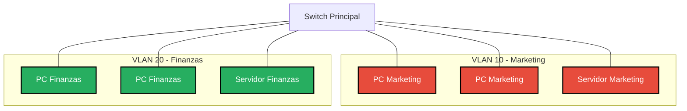
```mermaid
graph TD
    Switch[Switch Principal]
    PC1[PC Marketing]
    PC2[PC Marketing]
    PC3[PC Finanzas]
    PC4[PC Finanzas]
    Server1[Servidor Marketing]
    Server2[Servidor Finanzas]

    Switch --- PC1
    Switch --- PC2
    Switch --- PC3
    Switch --- PC4
    Switch --- Server1
    Switch --- Server2

    subgraph VLAN 10 - Marketing
        PC1
        PC2
        Server1
    end

    subgraph VLAN 20 - Finanzas
        PC3
        PC4
        Server2
    end

    classDef vlan10 fill:#e74c3c,stroke:#000000,stroke-width:2px,color:#FFFFFF
    classDef vlan20 fill:#27ae60,stroke:#000000,stroke-width:2px,color:#FFFFFF
    class PC1,PC2,Server1 vlan10
    class PC3,PC4,Server2 vlan20
```

---

# 🔒**2- ¿Qué es una VPN?**
Una **VPN** (Virtual Private Network) te permite utilizar una IP diferente frente a páginas web, servidores, etc. Esto se logra a través del servicio de un proveedor de Internet (ISP). Algunas empresas que ofrecen este servicio son:
- **Proton**
- **GhostVPN**
- **SurfShark**

En IT, se utiliza generalmente para el **trabajo remoto** 🏠.

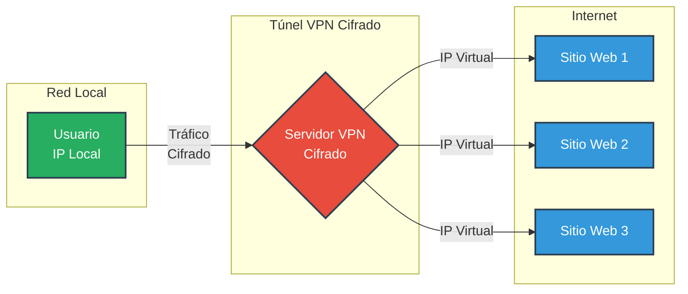
```mermaid
graph LR
    subgraph "Red Local"
        PC[Usuario<br/>IP Local]
    end
    
    subgraph "Túnel VPN Cifrado"
        VPN{Servidor VPN<br/>Cifrado}
    end
    
    subgraph "Internet"
        Web1[Sitio Web 1]
        Web2[Sitio Web 2]
        Web3[Sitio Web 3]
    end
    
    PC -->|"Tráfico<br/>Cifrado"| VPN
    VPN -->|"IP Virtual"| Web1
    VPN -->|"IP Virtual"| Web2
    VPN -->|"IP Virtual"| Web3
    
    style PC fill:#27ae60,stroke:#2c3e50,stroke-width:2px,color:#FFFFFF
    style VPN fill:#e74c3c,stroke:#2c3e50,stroke-width:2px,color:#FFFFFF
    style Web1 fill:#3498db,stroke:#2c3e50,stroke-width:2px,color:#FFFFFF
    style Web2 fill:#3498db,stroke:#2c3e50,stroke-width:2px,color:#FFFFFF
    style Web3 fill:#3498db,stroke:#2c3e50,stroke-width:2px,color:#FFFFFF
```

---

# 💾 **3- ¿Qué es una SAN?**
Una **SAN** (Storage Area Network) es una red especializada para acceder a dispositivos de almacenamiento. Comúnmente está compuesta de:
- **Hosts**
- **Switches**
- **Elementos de almacenamiento** interconectados usando diversas topologías y protocolos.

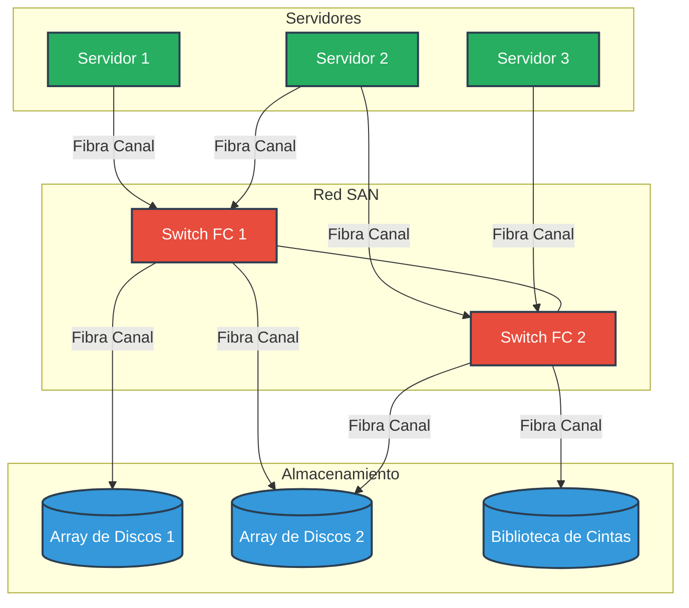
```mermaid
graph TD
    subgraph "Servidores"
        S1[Servidor 1]
        S2[Servidor 2]
        S3[Servidor 3]
    end
    
    subgraph "Red SAN"
        SW1[Switch FC 1]
        SW2[Switch FC 2]
    end
    
    subgraph "Almacenamiento"
        ST1[(Array de Discos 1)]
        ST2[(Array de Discos 2)]
        ST3[(Biblioteca de Cintas)]
    end
    
    S1 -->|"Fibra Canal"| SW1
    S2 -->|"Fibra Canal"| SW1
    S2 -->|"Fibra Canal"| SW2
    S3 -->|"Fibra Canal"| SW2
    
    SW1 --- SW2
    
    SW1 -->|"Fibra Canal"| ST1
    SW1 -->|"Fibra Canal"| ST2
    SW2 -->|"Fibra Canal"| ST2
    SW2 -->|"Fibra Canal"| ST3
    
    style S1 fill:#27ae60,stroke:#2c3e50,stroke-width:2px,color:#FFFFFF
    style S2 fill:#27ae60,stroke:#2c3e50,stroke-width:2px,color:#FFFFFF
    style S3 fill:#27ae60,stroke:#2c3e50,stroke-width:2px,color:#FFFFFF
    style SW1 fill:#e74c3c,stroke:#2c3e50,stroke-width:2px,color:#FFFFFF
    style SW2 fill:#e74c3c,stroke:#2c3e50,stroke-width:2px,color:#FFFFFF
    style ST1 fill:#3498db,stroke:#2c3e50,stroke-width:2px,color:#FFFFFF
    style ST2 fill:#3498db,stroke:#2c3e50,stroke-width:2px,color:#FFFFFF
    style ST3 fill:#3498db,stroke:#2c3e50,stroke-width:2px,color:#FFFFFF
```

---
# 🔄 **4- Diferencias entre un Hub, Repetidor, Router y SWITCH. Explicar las diferencias.**
- **Hub**: Conecta varios dispositivos en una red y transmite datos a todos ellos. No distingue a dónde va la información, envía todo a todos. 🖥️
  
- **Repetidor**: Regenera y amplifica una señal. Se usa para extender el alcance de una red, pero no filtra ni dirige datos. 📡

- **Router**: Conecta diferentes redes entre sí y provee acceso a Internet. Decide la mejor ruta para enviar datos basándose en direcciones IP. 🌍

- **Switch**: Conecta dispositivos en una red local y envía datos solo al destinatario correcto. Aprende direcciones MAC y mejora el rendimiento de la red. ⚙️

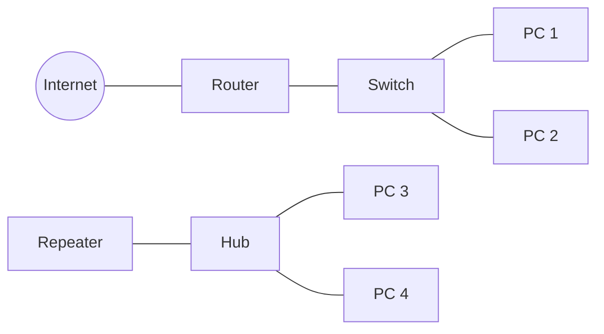
```mermaid
graph LR
    Internet((Internet))
    Router[Router]
    Switch[Switch]
    Hub[Hub]
    Repeater[Repeater]
    PC1[PC 1]
    PC2[PC 2]
    PC3[PC 3]
    PC4[PC 4]

    Internet --- Router
    Router --- Switch
    Switch --- PC1
    Switch --- PC2
    Hub --- PC3
    Hub --- PC4
    Repeater --- Hub
```

---
# 📜 **5- ¿Qué es un protocolo de comunicaciones?**
Es un conjunto de reglas que permite que las redes "hablen en el mismo idioma" y se comuniquen entre sí. Un protocolo define:
- **Restricciones**
- **Procedimientos**
- **Formatos** para el intercambio de paquetes.

---

# 📦 **6. TCP/IP y NetBIOS: Definición y diferencias**
- **TCP/IP** (Transmission Control Protocol/Internet Protocol) es un conjunto de protocolos que permite la comunicación entre dispositivos en redes, incluyendo Internet. Ofrece:
  - **Confiabilidad** ✅
  - **Corrección de errores** 🛠️
  - **Direccionamiento** a través de direcciones IP 🌍

- **NetBIOS** (Network Basic Input/Output System) es una interfaz de comunicación utilizada en redes locales (LAN) para permitir la conexión entre equipos sin necesidad de direcciones IP, usando nombres de dispositivos. 🖥️

- **Diferencias**: 
  - **TCP/IP** es más robusto y escalable, funcionando en redes grandes. 
  - **NetBIOS** es más limitado y suele utilizarse en redes pequeñas sin enrutamiento externo. 

---

# 📦 **7. Estructura de un paquete TCP/IP y los "flags"**
Un paquete TCP/IP está estructurado en encabezados IP y TCP, que contienen información como direcciones IP, puertos, números de secuencia y flags.

- **Encabezado IP** (Protocolo IP - Capa de Red): 
  - Proporciona las direcciones de origen y destino, así como información sobre cómo debe ser manejado el paquete en la red. 
  - Este encabezado es crucial para los routers, ya que les permite tomar decisiones basadas en la información contenida en él. 📬

- **Encabezado TCP**: 
  - Contiene detalles como los puertos de origen y destino, el número de secuencia y la suma de verificación hash. 
  - Básicamente se encarga de dividir los datos en partes más pequeñas, numerarlas y asegurarse de que lleguen completas y en orden. 📦

- **Datos o Payload**
  - Es la información real que se quiere transmitir, por ejemplo, una página web.

- **Flags**: 
  - Son indicadores en el encabezado que controlan el estado de la conexión, como:
    - **SYN** (inicio de conexión) 🔄
    - **ACK** (confirmación) ✅
    - **FIN** (cierre de conexión) ❌

---
# 🌍 **8. Tipos de redes según la geografía Las redes pueden clasificarse por su alcance geográfico:**
Las redes pueden clasificarse por su alcance geográfico:
- **PAN** (Personal Area Network): Para dispositivos personales, como Bluetooth. 📱
- **LAN** (Local Area Network): Redes pequeñas, como las de hogares o empresas. 🏠
- **MAN** (Metropolitan Area Network): Conectan ciudades o áreas grandes. 🌆
- **WAN** (Wide Area Network): Redes globales, como Internet. 🌐

---

# 🔗 **9. Tipos de redes según la topología Las redes también se clasifican por su estructura de conexión:**
Las redes también se clasifican por su estructura de conexión:
- **Red en estrella**: Dispositivos conectados a un nodo central. ⭐
- **Red en bus**: Todos los dispositivos comparten un único canal de comunicación. 🚌
- **Red en anillo**: Cada dispositivo está conectado con el siguiente, formando un círculo. 🔵
- **Red en malla**: Cada dispositivo tiene múltiples conexiones, ofreciendo redundancia. 🔗

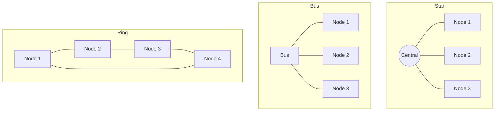
```mermaid
graph TD
    subgraph Star
        S_Central((Central))
        S_Node1[Node 1]
        S_Node2[Node 2]
        S_Node3[Node 3]
        S_Central --- S_Node1
        S_Central --- S_Node2
        S_Central --- S_Node3
    end

    subgraph Bus
        B_Bus[Bus]
        B_Node1[Node 1]
        B_Node2[Node 2]
        B_Node3[Node 3]
        B_Bus --- B_Node1
        B_Bus --- B_Node2
        B_Bus --- B_Node3
    end

    subgraph Ring
        R_Node1[Node 1]
        R_Node2[Node 2]
        R_Node3[Node 3]
        R_Node4[Node 4]
        R_Node1 --- R_Node2
        R_Node2 --- R_Node3
        R_Node3 --- R_Node4
        R_Node4 --- R_Node1
    end
```

---
# 📡 **10- Explicar el servicio de DHCP.**
Un servicio de **DHCP** es el cual se utiliza para asignar una IP a un dispositivo. Sin esta, se necesitaría asignar una IP estática como 192.168.1.X manualmente.

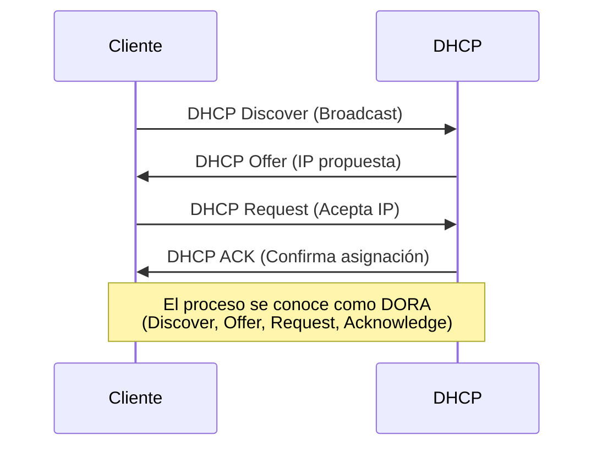
```mermaid
sequenceDiagram
    participant Cliente
    participant DHCP
    
    Cliente->>DHCP: DHCP Discover (Broadcast)
    DHCP->>Cliente: DHCP Offer (IP propuesta)
    Cliente->>DHCP: DHCP Request (Acepta IP)
    DHCP->>Cliente: DHCP ACK (Confirma asignación)
    
    Note over Cliente,DHCP: El proceso se conoce como DORA<br/>(Discover, Offer, Request, Acknowledge)
```

# 🌐 **11- Explicar el servicio de DNS.**
El **DNS** (Sistema de Nombres de Dominio) traduce los nombres de dominios aptos para lectura humana (por ejemplo, www.amazon.com) a direcciones IP aptas para lectura por parte de máquinas (por ejemplo, 192.0.2.44). 
Esto permite a los usuarios acceder a sitios web utilizando nombres fáciles de recordar, en lugar de tener que recordar direcciones IP numéricas. 🌍

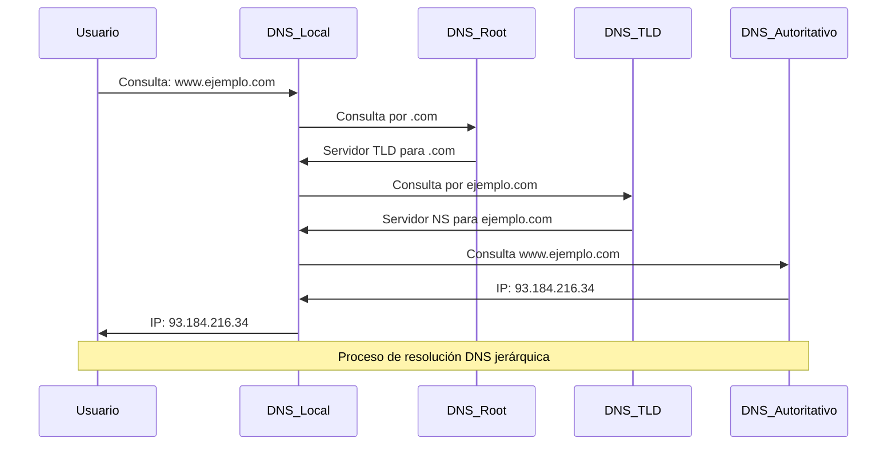
```mermaid
sequenceDiagram
    participant Usuario
    participant DNS_Local
    participant DNS_Root
    participant DNS_TLD
    participant DNS_Autoritativo
    
    Usuario->>DNS_Local: Consulta: www.ejemplo.com
    DNS_Local->>DNS_Root: Consulta por .com
    DNS_Root->>DNS_Local: Servidor TLD para .com
    DNS_Local->>DNS_TLD: Consulta por ejemplo.com
    DNS_TLD->>DNS_Local: Servidor NS para ejemplo.com
    DNS_Local->>DNS_Autoritativo: Consulta www.ejemplo.com
    DNS_Autoritativo->>DNS_Local: IP: 93.184.216.34
    DNS_Local->>Usuario: IP: 93.184.216.34
    
    Note over Usuario,DNS_Autoritativo: Proceso de resolución DNS jerárquica
```

---
# 📡 **12- Explicar las tecnologías Wireless, y sus estándares.**
"**Wireless**", o comunicación inalámbrica, describe la transmisión de datos entre dispositivos utilizando ondas de radio u otras ondas electromagnéticas, eliminando por completo la necesidad de cables para la comunicación de los mismos.

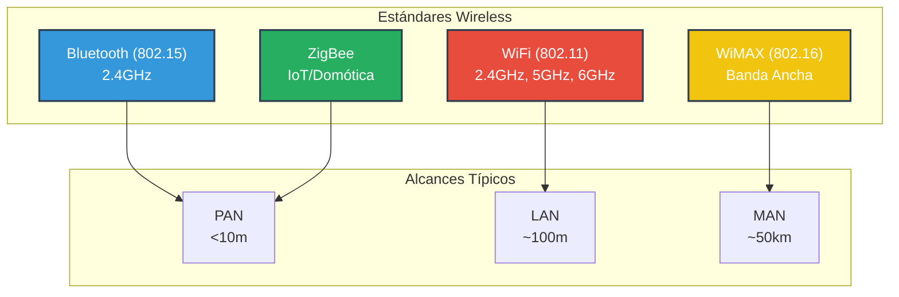
```mermaid
graph TD
    subgraph "Estándares Wireless"
        WiFi["WiFi (802.11)<br/>2.4GHz, 5GHz, 6GHz"]
        BT["Bluetooth (802.15)<br/>2.4GHz"]
        ZB["ZigBee<br/>IoT/Domótica"]
        WiMAX["WiMAX (802.16)<br/>Banda Ancha"]
    end
    
    subgraph "Alcances Típicos"
        PAN["PAN<br/><10m"]
        LAN["LAN<br/>~100m"]
        MAN["MAN<br/>~50km"]
    end
    
    WiFi --> LAN
    BT --> PAN
    ZB --> PAN
    WiMAX --> MAN
    
    style WiFi fill:#e74c3c,stroke:#2c3e50,stroke-width:2px,color:#FFFFFF
    style BT fill:#3498db,stroke:#2c3e50,stroke-width:2px,color:#FFFFFF
    style ZB fill:#27ae60,stroke:#2c3e50,stroke-width:2px,color:#FFFFFF
    style WiMAX fill:#f1c40f,stroke:#2c3e50,stroke-width:2px,color:#FFFFFF
```

### Estándares:
- **IEEE 802.11**: Estándar para redes de área local inalámbricas (WLAN), conocido como **Wi-Fi**. Permite la conexión de dispositivos dentro de un área limitada, como hogares u oficinas, usando ondas de radio en las bandas de 2.4 GHz y 5 GHz, y en versiones más recientes también 6 GHz (Wi-Fi 6E). 📶

- **IEEE 802.15**: Estándar para redes de área personal inalámbricas (WPAN). Incluye tecnologías como **Bluetooth**, que permite la comunicación entre dispositivos personales mediante un proceso de emparejamiento, con un alcance típico entre 1 y 100 metros, y **ZigBee**, usada en aplicaciones de bajo consumo como domótica e IoT. 🔗

- **IEEE 802.16**: Estándar para redes metropolitanas inalámbricas (WMAN), conocido como **WiMAX** (Interoperabilidad Mundial para Acceso por Microondas). Utiliza una topología punto a multipunto para ofrecer acceso de banda ancha inalámbrico sobre grandes distancias, ideal para zonas rurales o sin infraestructura cableada. 🌆

- **GSM** (Sistema Global para Comunicaciones Móviles): Estándar de comunicaciones móviles de segunda generación (2G). Incluye especificaciones de la capa física que permiten la implementación del protocolo **GPRS** (Servicio General de Radio por Paquetes) para la transmisión de datos sobre redes de telefonía celular. 📱

---

# 🔄 **13- ¿Qué es un Proxy?**
Un **proxy** es un servidor que recibe las peticiones de un usuario y las traslada a otro servidor. Una **VPN** también funciona como un servidor proxy, pero toma todo el tráfico entrante de un usuario, en vez de solamente algunas peticiones. 🔍

---
# 🌉 **14- Explicar el protocolo Spanning tree.**
El **Spanning Tree Protocol (STP)** es un protocolo de red de capa 2 (Enlace de Datos) que evita la formación de tramas duplicadas al detectar y bloquear automáticamente caminos redundantes que puedan generar bucles en una red de switches. 
STP asegura que haya un único camino activo entre dos dispositivos de red, creando una topología lógica libre de bucles (spanning tree), mientras mantiene la redundancia física disponible para recuperación ante fallos. 🔄

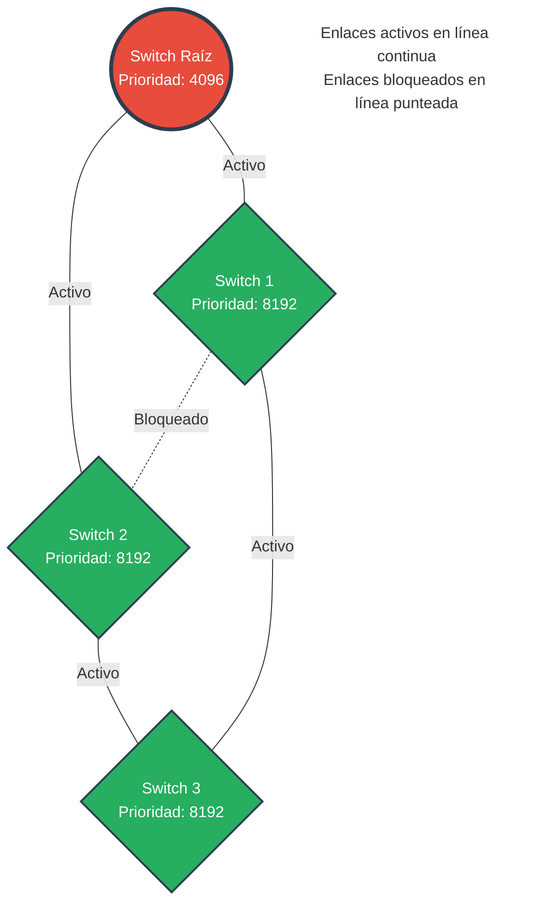
```mermaid
graph TD
    Root((Switch Raíz<br/>Prioridad: 4096))
    SW1{Switch 1<br/>Prioridad: 8192}
    SW2{Switch 2<br/>Prioridad: 8192}
    SW3{Switch 3<br/>Prioridad: 8192}
    Info[Enlaces activos en línea continua<br/>Enlaces bloqueados en línea punteada]
    
    Root ---|"Activo"| SW1
    Root ---|"Activo"| SW2
    SW1 -.-|"Bloqueado"| SW2
    SW2 ---|"Activo"| SW3
    SW1 ---|"Activo"| SW3
    
    style Root fill:#e74c3c,stroke:#2c3e50,stroke-width:4px,color:#FFFFFF
    style SW1 fill:#27ae60,stroke:#2c3e50,stroke-width:2px,color:#FFFFFF
    style SW2 fill:#27ae60,stroke:#2c3e50,stroke-width:2px,color:#FFFFFF
    style SW3 fill:#27ae60,stroke:#2c3e50,stroke-width:2px,color:#FFFFFF
    style Info fill:none,stroke:none
```

---
# 🛣️ **15- Explicar el protocolo de comunicaciones OSPF.**
El protocolo **OSPF** (Open Shortest Path First) es un tipo de enrutamiento que ayuda a encontrar el mejor camino para que los datos viajen por una red. 
Para hacerlo, detecta cómo están conectados los routers cercanos, comparte esa información con ellos y, si hay varias rutas posibles hacia un destino, elige la más rápida o conveniente según ciertas reglas. 
Además, si la red cambia, OSPF actualiza las rutas automáticamente para que los datos siempre tomen el mejor camino disponible. 🚀

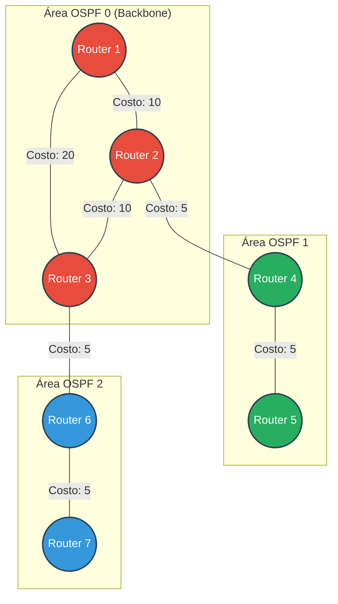
```mermaid
graph TD
    subgraph "Área OSPF 0 (Backbone)"
        R1((Router 1))
        R2((Router 2))
        R3((Router 3))
    end
    
    subgraph "Área OSPF 1"
        R4((Router 4))
        R5((Router 5))
    end
    
    subgraph "Área OSPF 2"
        R6((Router 6))
        R7((Router 7))
    end
    
    R1 ---|"Costo: 10"| R2
    R2 ---|"Costo: 10"| R3
    R1 ---|"Costo: 20"| R3
    R2 ---|"Costo: 5"| R4
    R4 ---|"Costo: 5"| R5
    R3 ---|"Costo: 5"| R6
    R6 ---|"Costo: 5"| R7
    
    style R1 fill:#e74c3c,stroke:#2c3e50,stroke-width:2px,color:#FFFFFF
    style R2 fill:#e74c3c,stroke:#2c3e50,stroke-width:2px,color:#FFFFFF
    style R3 fill:#e74c3c,stroke:#2c3e50,stroke-width:2px,color:#FFFFFF
    style R4 fill:#27ae60,stroke:#2c3e50,stroke-width:2px,color:#FFFFFF
    style R5 fill:#27ae60,stroke:#2c3e50,stroke-width:2px,color:#FFFFFF
    style R6 fill:#3498db,stroke:#2c3e50,stroke-width:2px,color:#FFFFFF
    style R7 fill:#3498db,stroke:#2c3e50,stroke-width:2px,color:#FFFFFF
```

---
# 🔗 **16- Explicar el protocolo ARP.**
El protocolo **ARP** (Address Resolution Protocol) es un sistema que ayuda a conectar las direcciones IP, que pueden cambiar, con las direcciones físicas fijas de los dispositivos en una red local (LAN). 
Básicamente, convierte una dirección IP en la dirección **MAC** de un dispositivo para que los datos puedan llegar a su destino correctamente dentro de la red. 📡

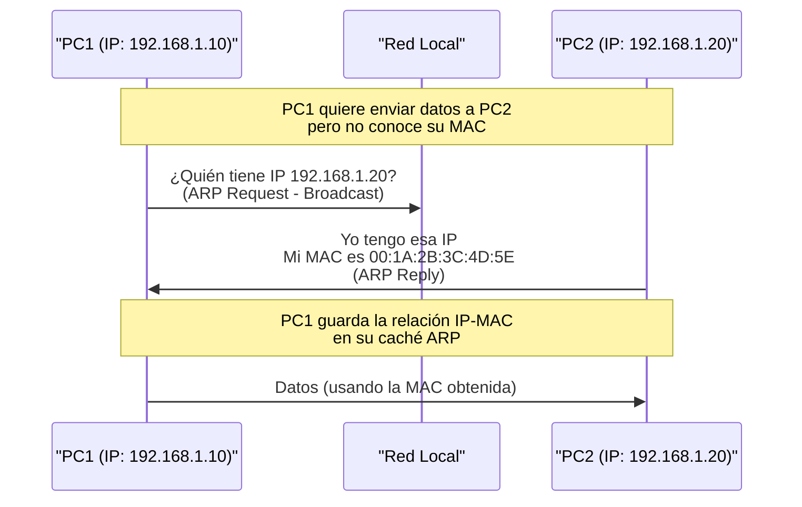
```mermaid
sequenceDiagram
    participant PC1 as "PC1 (IP: 192.168.1.10)"
    participant Red as "Red Local"
    participant PC2 as "PC2 (IP: 192.168.1.20)"
    
    Note over PC1,PC2: PC1 quiere enviar datos a PC2<br/>pero no conoce su MAC
    
    PC1->>Red: ¿Quién tiene IP 192.168.1.20?<br/>(ARP Request - Broadcast)
    PC2->>PC1: Yo tengo esa IP<br/>Mi MAC es 00:1A:2B:3C:4D:5E<br/>(ARP Reply)
    
    Note over PC1,PC2: PC1 guarda la relación IP-MAC<br/>en su caché ARP
    
    PC1->>PC2: Datos (usando la MAC obtenida)
```

---

# 🔥 **17- ¿Qué es un Firewall?**
Un **firewall** es una herramienta de seguridad que controla qué datos pueden entrar o salir de una red o computadora. 
Actúa como una especie de "puerta" o "filtro" entre tu red y el resto de Internet, permitiendo solo el tráfico autorizado y bloqueando el que puede ser peligroso. 🔒

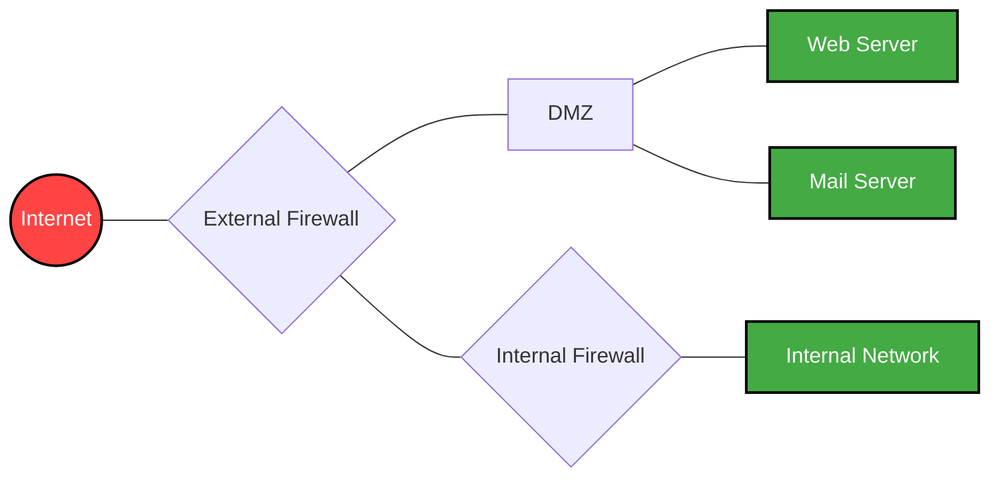
```mermaid
graph LR
    Internet((Internet))
    Firewall1{External Firewall}
    Firewall2{Internal Firewall}
    DMZ[DMZ]
    Internal[Internal Network]
    WebServer[Web Server]
    MailServer[Mail Server]

    Internet --- Firewall1
    Firewall1 --- DMZ
    DMZ --- WebServer
    DMZ --- MailServer
    Firewall1 --- Firewall2
    Firewall2 --- Internal

    classDef secure fill:#44AA44,stroke:#000000,stroke-width:2px,color:#FFFFFF
    classDef danger fill:#FF4444,stroke:#000000,stroke-width:2px,color:#FFFFFF
    class Internet danger
    class Internal,WebServer,MailServer secure
```

---
# 🛡️ **18- ¿Qué es una DMZ?**
Una **DMZ (Zona Desmilitarizada)** en un área separada dentro de una red donde se colocan los servidores que deben ser accesibles desde Internet, como páginas web o correos electrónicos, pero sin dar acceso directo a la red interna principal. Funciona como una zona intermedia de seguridad: si alguien intenta atacar desde afuera, solo llega a la DMZ y no a los sistemas más importantes de la red interna.

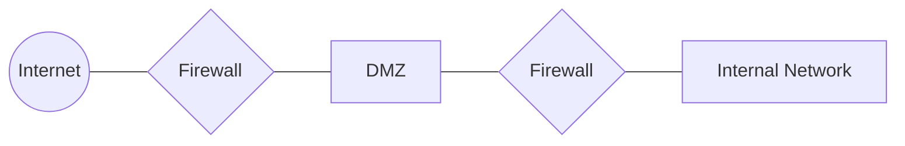
```mermaid
graph LR
    Internet((Internet))
    FW1{Firewall}
    DMZ[DMZ]
    FW2{Firewall}
    Internal[Internal Network]
    
    Internet --- FW1
    FW1 --- DMZ
    DMZ --- FW2
    FW2 --- Internal
```

---

# 🌉 **19- ¿Qué es un Gateway?**
Una **gateway** o puerta de enlace es el dispositivo que conecta distintas redes. Su propósito es traducir la información del protocolo utilizado en una red de origen al protocolo usado en la red de destino. 
Si un dispositivo dentro de una red quiere comunicarse con otro que está fuera de esa misma red, se necesita una gateway. 

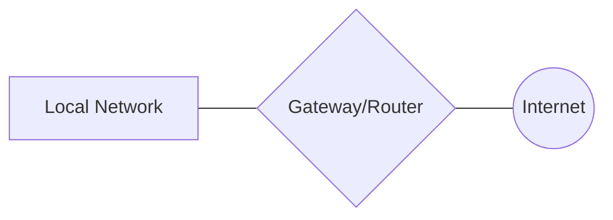
```mermaid
graph LR
    LAN[Local Network]
    Gateway{Gateway/Router}
    Internet((Internet))
    
    LAN --- Gateway
    Gateway --- Internet
```

Hoy en día, es muy común que las gateways se combinen con los enrutadores, por lo que muchas veces se puede hablar de una gateway refiriéndose a un enrutador. 
Un ejemplo muy común de esta combinación es el router que te instalan cuando contratás un servicio de internet en tu casa: este utiliza una gateway para conectar los dispositivos de la red local con redes externas, como Internet. 🌐

---

# ⚖️ **20- Según Microsoft, ¿qué significa NLB?**
**NLB** significa **Network Load Balancing** o en español, **equilibrio de carga de red**. 
Es una función de Windows Server que sirve para distribuir y equilibrar el tráfico de red entre varios servidores como si fueran uno solo, mejorando así la **disponibilidad** y la **escalabilidad**. 📈

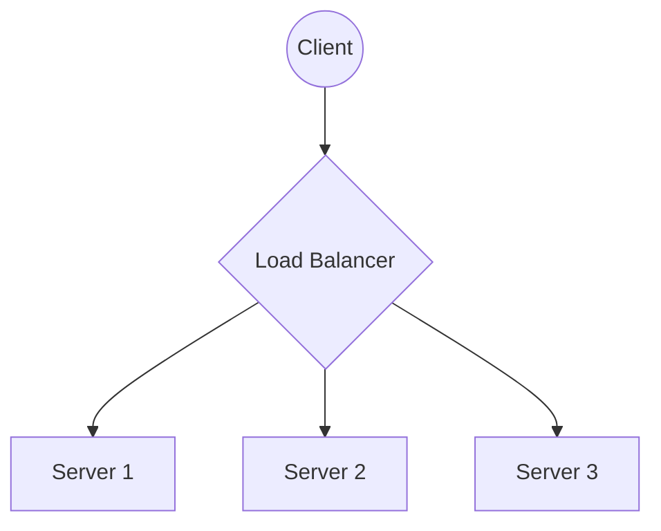
```mermaid
graph TD
    Client((Client))
    LB{Load Balancer}
    S1[Server 1]
    S2[Server 2]
    S3[Server 3]
    
    Client --> LB
    LB --> S1
    LB --> S2
    LB --> S3
```

---

# 🔗 **21- Tipos de enlace: MPLS, LAN to LAN, microonda, VSAT**

### a. Explicación de tipos de enlace:

**MPLS (Multiprotocol Label Switching):**
- Tecnología de transporte de datos que opera entre la capa 2 y capa 3 del modelo OSI
- Usa etiquetas para dirigir el tráfico de manera más eficiente
- Permite priorizar ciertos tipos de datos sobre otros
- Ideal para grandes redes empresariales 🏢

**LAN to LAN:**
- Conexión directa entre redes locales
- Puede implementarse a través de VPN o enlaces dedicados
- Permite compartir recursos entre ubicaciones
- Común en empresas con múltiples oficinas 🏢

**Microonda:**
- Transmisión punto a punto usando ondas electromagnéticas
- Requiere línea de vista directa entre antenas
- Frecuencias típicas entre 2 y 40 GHz
- Útil para distancias medias sin obstáculos 📡

**VSAT (Very Small Aperture Terminal):**
- Comunicación satelital bidireccional
- Usa antenas pequeñas (menos de 3 metros)
- Cobertura global independiente de la infraestructura terrestre
- Ideal para ubicaciones remotas 🛰️

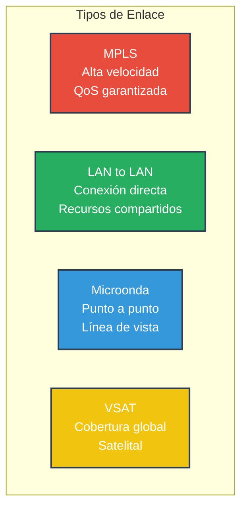
```mermaid
graph TD
    subgraph "Tipos de Enlace"
        MPLS[MPLS<br/>Alta velocidad<br/>QoS garantizada]
        LAN[LAN to LAN<br/>Conexión directa<br/>Recursos compartidos]
        MW[Microonda<br/>Punto a punto<br/>Línea de vista]
        VSAT[VSAT<br/>Cobertura global<br/>Satelital]
    end
    
    style MPLS fill:#e74c3c,stroke:#2c3e50,stroke-width:2px,color:#FFFFFF
    style LAN fill:#27ae60,stroke:#2c3e50,stroke-width:2px,color:#FFFFFF
    style MW fill:#3498db,stroke:#2c3e50,stroke-width:2px,color:#FFFFFF
    style VSAT fill:#f1c40f,stroke:#2c3e50,stroke-width:2px,color:#FFFFFF
```

### b. Tipos de enlaces adicionales:

**Fibra Óptica:**
- Transmisión mediante pulsos de luz
- Altísima velocidad y ancho de banda
- Inmune a interferencias electromagnéticas
- Ideal para grandes volúmenes de datos 🔌

**4G/5G:**
- Conectividad móvil de alta velocidad
- Gran cobertura en áreas urbanas
- Permite movilidad total
- Ideal para dispositivos móviles 📱

### c. Ranking de enlaces (1-6, siendo 1 el mejor):

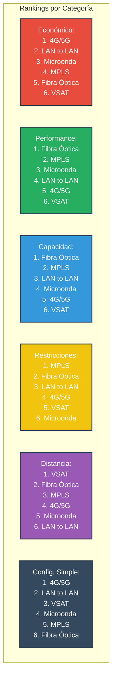
```mermaid
graph TD
    subgraph "Rankings por Categoría"
        E1[Económico:<br/>1. 4G/5G<br/>2. LAN to LAN<br/>3. Microonda<br/>4. MPLS<br/>5. Fibra Óptica<br/>6. VSAT]
        E2[Performance:<br/>1. Fibra Óptica<br/>2. MPLS<br/>3. Microonda<br/>4. LAN to LAN<br/>5. 4G/5G<br/>6. VSAT]
        E3[Capacidad:<br/>1. Fibra Óptica<br/>2. MPLS<br/>3. LAN to LAN<br/>4. Microonda<br/>5. 4G/5G<br/>6. VSAT]
        E4[Restricciones:<br/>1. MPLS<br/>2. Fibra Óptica<br/>3. LAN to LAN<br/>4. 4G/5G<br/>5. VSAT<br/>6. Microonda]
        E5[Distancia:<br/>1. VSAT<br/>2. Fibra Óptica<br/>3. MPLS<br/>4. 4G/5G<br/>5. Microonda<br/>6. LAN to LAN]
        E6[Config. Simple:<br/>1. 4G/5G<br/>2. LAN to LAN<br/>3. VSAT<br/>4. Microonda<br/>5. MPLS<br/>6. Fibra Óptica]
    end
    
    style E1 fill:#e74c3c,stroke:#2c3e50,stroke-width:2px,color:#FFFFFF
    style E2 fill:#27ae60,stroke:#2c3e50,stroke-width:2px,color:#FFFFFF
    style E3 fill:#3498db,stroke:#2c3e50,stroke-width:2px,color:#FFFFFF
    style E4 fill:#f1c40f,stroke:#2c3e50,stroke-width:2px,color:#FFFFFF
    style E5 fill:#9b59b6,stroke:#2c3e50,stroke-width:2px,color:#FFFFFF
    style E6 fill:#34495e,stroke:#2c3e50,stroke-width:2px,color:#FFFFFF
```

### d. Escenarios y enlaces recomendados:

1. **Conectividad de varios call centers con un data center central:**
   - **Enlace recomendado**: MPLS
   - **Razón**: Ofrece QoS garantizada, esencial para VoIP, y permite priorizar el tráfico crítico

2. **Conectar los datos de los pozos petroleros durante 15 minutos por día:**
   - **Enlace recomendado**: VSAT
   - **Razón**: Ideal para ubicaciones remotas y transmisiones periódicas de datos

3. **Comunicar dos edificios enfrentados en la misma calle:**
   - **Enlace recomendado**: Microonda
   - **Razón**: Solución costo-efectiva para distancias cortas con línea de vista directa

---
# 📶 **22- Describir la tecnología LTE.**
**Long Term Evolution (LTE)** es un estándar de comunicación inalámbrica de cuarta generación (4G) que ofrece:
- **Velocidades de datos más rápidas** y menor latencia que tecnologías anteriores como 3G, siendo entre 5 y 10 veces más rápido que 3G. ⚡
- Puede alcanzar hasta **100 Mbps de descarga** y **50 Mbps de carga**. 

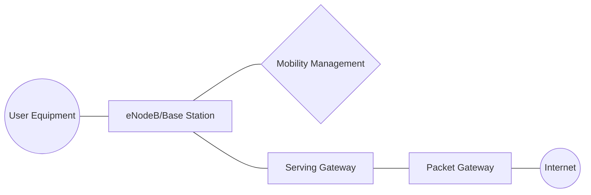
```mermaid
graph LR
    UE((User Equipment))
    eNB[eNodeB/Base Station]
    MME{Mobility Management}
    SGW[Serving Gateway]
    PGW[Packet Gateway]
    Internet((Internet))
    
    UE --- eNB
    eNB --- MME
    eNB --- SGW
    SGW --- PGW
    PGW --- Internet
```

Está basada en el protocolo IP, lo que facilita la transmisión de datos, voz y video de forma más eficiente, en lugar de utilizar sistemas de conmutación por circuitos como en generaciones anteriores (3G y 2G). 📱

Además, tiene soporte de voz (**VoLTE**), lo que mejora la calidad de las llamadas de voz y permite realizar llamadas y navegar por Internet de manera simultánea. 
LTE fue fundamental para el avance de la tecnología móvil, ya que no solo permite un acceso más rápido a Internet, sino que también soporta aplicaciones avanzadas como **streaming**, **realidad aumentada** e **IoT**. También facilita la transición hacia la tecnología **5G**. 🚀

---

# 💬 **23- Explique la solución de Microsoft Teams. Si quieren describir otra solución de otra empresa es también válido**
**Microsoft Teams** es una plataforma para la comunicación y colaboración entre personas de un mismo equipo, empresa u organización. 
Es una aplicación de mensajería que combina:
- **Chat persistente** en el lugar de trabajo
- **Videoconferencias**
- **Almacenamiento de archivos**
- **Integración de aplicaciones** 📂

Otra solución sería **Slack**, que es una plataforma de comunicación y colaboración para equipos basada en canales. Permite a las personas conectar, compartir información y colaborar en proyectos. 🔗

---

# 📊 **24- ¿Qué significa aplicar calidad en un enlace MPLS?**
Aplicar calidad significa definir y garantizar un nivel de tráfico suficiente y aplicar mecanismos para asegurar que el tráfico de la red se transmita de forma eficiente. 
Esto se hace mediante **QoS** (Quality of Service). 

De esta manera, clasificás el tráfico, priorizás lo que necesita menor latencia, reservás una parte mínima de ancho de banda para ciertos tipos de tráfico crítico, aplicás políticas para evitar saturaciones y se usan técnicas para manejar el retardo y la pérdida de paquetes. 
Eso es aplicar calidad en un enlace MPLS, y todo esto sirve para mejorar la experiencia del usuario, garantizar el funcionamiento de servicios críticos y optimizar el uso del enlace MPLS. 📈

---

# 🔌 **25- ¿Qué diferencias puede encontrar entre una conexión Coaxial, UTP o Fibra?**
### Coaxial
- **Velocidad**: Hasta 1 Gbps.
- **Alcance**: Medio. A medida que el tramo se alarga, se pierde calidad y velocidad.
- **Interferencias**: Resistente a interferencias externas.
- **Costo**: Medio.
- **Uso principal**: Aún se utiliza bastante para televisión por cable, servicios de internet y redes telefónicas interurbanas. 📺

### UTP
- **Velocidad**: Hasta 40 Gbps en categoría Cat8.
- **Alcance**: Bajo. Para alcanzar los 40 Gbps (Cat8), el tramo debe ser de hasta 15 metros como máximo.
- **Interferencias**: Más vulnerable a interferencias electromagnéticas.
- **Costo**: Bajo.
- **Uso principal**: Muy utilizado en redes LAN, conexiones telefónicas y sistemas de cámaras de seguridad.

### Fibra
- **Velocidad**: Puede alcanzar velocidades del orden de los Tbps.
- **Alcance**: Alto. Permite transmitir datos a varios kilómetros sin pérdidas significativas.
- **Interferencias**: Inmune a interferencias electromagnéticas (transmite mediante luz, no electricidad).
- **Costo**: Alto, aunque tiende a reducirse con el tiempo.
- **Uso principal**: Se emplea en cables submarinos, sistemas de audio óptico y para ofrecer internet de alta velocidad tanto en hogares como en empresas. 

---

# 📜 **26- Según Cisco, ¿qué significa CCENT, CCNA y CCNP? Descripción breve del Track Routing & Switching y de  algún otro a elección (ej. Wireless, Security, Cloud, etc).**

- **CCENT** (Cisco Certified Entry Networking Technician): Certificación de entrada que valida habilidades para instalar, operar y solucionar problemas en pequeñas redes empresariales, incluyendo seguridad básica. 🛠️

- **CCNA** (Cisco Certified Network Associate): Certificación de nivel asociado que valida la capacidad de gestionar redes enrutadas y conmutadas de tamaño mediano, incluyendo conexiones WAN. 🌐

- **CCNP** (Cisco Certified Network Professional): Certificación profesional que valida conocimientos avanzados en planificación, implementación y solución de problemas en redes empresariales complejas. 📈

### Track Routing & Switching
El track de **Routing & Switching** (Enrutamiento y Conmutación) era la base fundamental de las certificaciones Cisco, centrado en tecnologías y protocolos para redes cableadas. Los profesionales deben demostrar habilidades en:
- Manejo de direcciones IP (IPv4 e IPv6) y subredes. 🌍
- Configuración y solución de problemas en routers y switches Cisco. 🔧
- Creación y gestión de VLANs para segmentar redes y mejorar seguridad. 🔒

### Track Wireless
El track de **Wireless** (Inalámbrico) está enfocado en diseño, implementación y solución de problemas en redes inalámbricas. 
Los profesionales deben ser capaces de:
- Comprender tecnologías Wi-Fi (IEEE 802.11) y sus estándares. 📶
- Implementar métodos de autenticación y seguridad (como WPA2/3). 🔐
- Solucionar problemas de cobertura, interferencia y rendimiento en redes inalámbricas. 📡

---

# 🌐 **27- Explique el modelo OSI.**
El **Modelo OSI** (Open Systems Interconnection) es un marco de referencia que estandariza las funciones de comunicación en redes de computadoras en **siete capas**, facilitando la interconexión entre diferentes sistemas. 

Las capas son:

1. **Capa Física**: Transmite datos en forma de bits a través de medios físicos. 🔌
2. **Capa de Enlace de Datos**: Proporciona la transferencia de datos entre nodos en la misma red y maneja errores de transmisión. 📡
3. **Capa de Red**: Se encarga del enrutamiento de datos entre diferentes redes y gestiona direcciones IP. 🌍
4. **Capa de Transporte**: Asegura la entrega confiable de datos y controla el flujo y la segmentación. 📦
5. **Capa de Sesión**: Establece, gestiona y termina sesiones de comunicación entre aplicaciones. 🔄
6. **Capa de Presentación**: Traduce y formatea los datos para la capa de aplicación, asegurando que sean comprensibles. 🖥️
7. **Capa de Aplicación**: Proporciona servicios de red a las aplicaciones del usuario final, como correo electrónico y navegación web. 📧

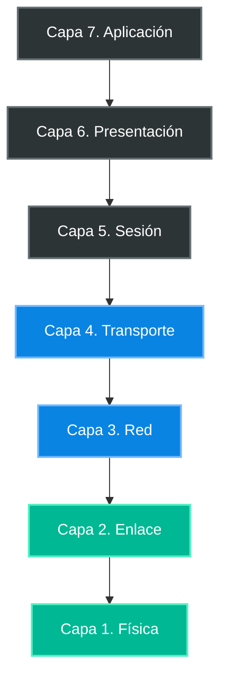
```mermaid
graph TB
    A["Capa 7. Aplicación"]
    B["Capa 6. Presentación"]
    C["Capa 5. Sesión"]
    D["Capa 4. Transporte"]
    E["Capa 3. Red"]
    F["Capa 2. Enlace"]
    G["Capa 1. Física"]
    
    A --> B
    B --> C
    C --> D
    D --> E
    E --> F
    F --> G

    style A fill:#2d3436,stroke:#636e72,stroke-width:2px,color:#fff
    style B fill:#2d3436,stroke:#636e72,stroke-width:2px,color:#fff
    style C fill:#2d3436,stroke:#636e72,stroke-width:2px,color:#fff
    style D fill:#0984e3,stroke:#74b9ff,stroke-width:2px,color:#fff
    style E fill:#0984e3,stroke:#74b9ff,stroke-width:2px,color:#fff
    style F fill:#00b894,stroke:#55efc4,stroke-width:2px,color:#fff
    style G fill:#00b894,stroke:#55efc4,stroke-width:2px,color:#fff
```

---

# **🤓 28- Realizar cuestionario online y copiar el resultado: (1 por cada integrante)**
Nicolas:

---

Ulises:  
  

---

Agustin:  

---

# 📡 **29- Explicar el estándar IEEE 802.3 regula la red. Cómo se implementa, ventajas y desventajas.**
**IEEE 802.3**: Es un estándar que regula las redes **Ethernet**, definiendo las especificaciones para la transmisión de datos en redes de área local (LAN) mediante cables.

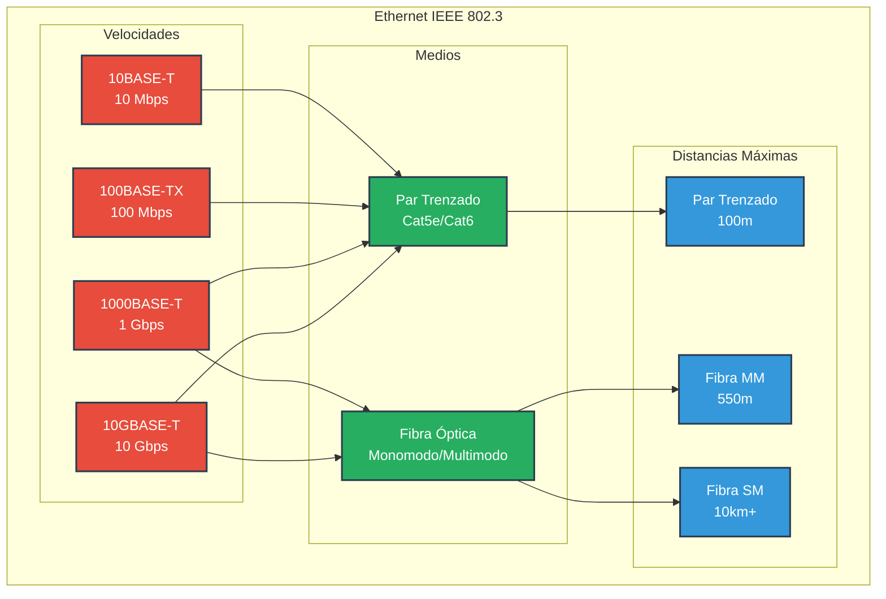
```mermaid
graph TD
    subgraph "Ethernet IEEE 802.3"
        subgraph "Velocidades"
            E1[10BASE-T<br/>10 Mbps]
            E2[100BASE-TX<br/>100 Mbps]
            E3[1000BASE-T<br/>1 Gbps]
            E4[10GBASE-T<br/>10 Gbps]
        end
        
        subgraph "Medios"
            M1[Par Trenzado<br/>Cat5e/Cat6]
            M2[Fibra Óptica<br/>Monomodo/Multimodo]
        end
        
        subgraph "Distancias Máximas"
            D1[Par Trenzado<br/>100m]
            D2[Fibra MM<br/>550m]
            D3[Fibra SM<br/>10km+]
        end
    end
    
    E1 --> M1
    E2 --> M1
    E3 --> M1
    E4 --> M1
    E3 --> M2
    E4 --> M2
    
    M1 --> D1
    M2 --> D2
    M2 --> D3
    
    style E1 fill:#e74c3c,stroke:#2c3e50,stroke-width:2px,color:#FFFFFF
    style E2 fill:#e74c3c,stroke:#2c3e50,stroke-width:2px,color:#FFFFFF
    style E3 fill:#e74c3c,stroke:#2c3e50,stroke-width:2px,color:#FFFFFF
    style E4 fill:#e74c3c,stroke:#2c3e50,stroke-width:2px,color:#FFFFFF
    style M1 fill:#27ae60,stroke:#2c3e50,stroke-width:2px,color:#FFFFFF
    style M2 fill:#27ae60,stroke:#2c3e50,stroke-width:2px,color:#FFFFFF
    style D1 fill:#3498db,stroke:#2c3e50,stroke-width:2px,color:#FFFFFF
    style D2 fill:#3498db,stroke:#2c3e50,stroke-width:2px,color:#FFFFFF
    style D3 fill:#3498db,stroke:#2c3e50,stroke-width:2px,color:#FFFFFF
```

### Implementación
Se implementa a través de dispositivos como switches y routers que utilizan cables de par trenzado o fibra óptica para conectar computadoras y otros dispositivos en una red. 🔗

### Ventajas
- **Alta velocidad**: Soporta velocidades de hasta **100 Gbps** en versiones avanzadas. ⚡
- **Estandarización**: Amplia aceptación y compatibilidad entre diferentes fabricantes. 🤝
- **Costo-efectividad**: Los componentes de Ethernet son generalmente más económicos y fáciles de obtener. 💵

### Desventajas
- **Alcance limitado**: La distancia máxima para cables de par trenzado es de **100 metros**, lo que puede ser una limitación en grandes instalaciones. 📏
- **Interferencias**: Puede ser susceptible a interferencias electromagnéticas
- **Colisiones**: En redes más antiguas, el uso de CSMA/CD puede llevar a colisiones de datos, aunque esto disminuyo con el uso de switches.

# 📡 **30- Explicar el estándar IEEE 802.4 regula la red.**
El estándar **IEEE 802.4** regula las redes de área local (LAN) utilizando un **método de acceso por token bus**. 
Se implementa mediante un sistema de **token** que permite a los dispositivos en la red tomar turnos para transmitir datos, evitando colisiones. 
Este enfoque se basa en un **cable coaxial** como medio de transmisión. 🔗

---
# 📧 **31- ¿Qué protocolos se usan para enviar y recibir correo?**
Los protocolos que se usan para enviar y recibir correo son:
- **SMTP** (Simple Mail Transfer Protocol) para el envío de correos. 📤
- **POP3** (Post Office Protocol Version 3) para la recepción de correos. 📥

```mermaid
sequenceDiagram
    participant User1 as Sender
    participant SMTP as SMTP Server
    participant POP3 as POP3 Server
    participant User2 as Receiver
    
    User1->>SMTP: Send email (SMTP)
    SMTP->>POP3: Forward email
    User2->>POP3: Request emails (POP3)
    POP3->>User2: Download emails
```

---
# 📬 **32- ¿Qué protocolo puede usarse para leer correo recibido?** 
El protocolo que puede usarse para leer correo recibido es el **POP3**. 📧

---
# 🌐 **33- Diferencias entre IPV4 e IPV6**
### **IPV4:**
- **Lanzamiento**: 1981
- **Tamaño de direcciones**: 32 bits
- **Formato de la IP**: Notación decimal con puntos (ej: 192.168.0.1)
- **Cantidad de IPs**: 2³² = 4 mil millones
- **Tamaño de paquete mínimo requerido**: 576 bytes
- **Configuración**: DHCP o manual
- **Observaciones**: Se reutilizan direcciones IP. Tiene rangos reservados para uso privado, loopback, broadcast y red. 🔄

### **IPV6:**
- **Lanzamiento**: 1999
- **Tamaño de direcciones**: 128 bits
- **Formato de la IP**: Notación hexadecimal, separada por dos puntos (ej: 2001:0db8:85a3::8a2e:0370:7334)
- **Cantidad de IPs**: 2¹²⁸ = 340 undecillones
- **Tamaño de paquete mínimo requerido**: 1.280 bytes
- **Configuración**: Permite configuración automática sin necesidad de DHCP
- **Observaciones**: Está diseñado para que nunca falten direcciones. Cada persona podría tener trillones de IPs sin problema. 🌌

```mermaid
graph LR
    subgraph IPv4
        IPv4_Header[32 bits header]
        IPv4_Addr["192.168.1.1"]
    end

    subgraph IPv6
        IPv6_Header[128 bits header]
        IPv6_Addr["2001:0db8:85a3::8a2e:0370:7334"]
    end
```

---

# 👥 **34- (Individual para cada integrante del grupo) ¿Qué experiencia tienen en redes?**
**Ulises**: He configurado una aplicación para producción usando Nginx, creando un subdominio en los registros de DNS con un CNAME y asignando los Certificados con Let's Encrypt.

**Nicolas**: Configuré varios repetidores de manera inalámbrica y hace poco conecté un repetidor mediante cable Ethernet que tuve que configurar el repetidor para que no asignara direcciones IP, sino que las asignara solo el router principal. Recientemente, ingresé al panel de configuración de mi router para cambiar la contraseña.

**Agustin**: trabaje configurando router y switch en un curso de redes y participe en un tendido de fibra optica.  

**Gabriel**: No tengo experiencia.
